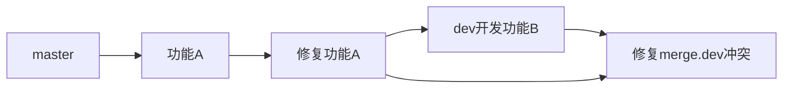
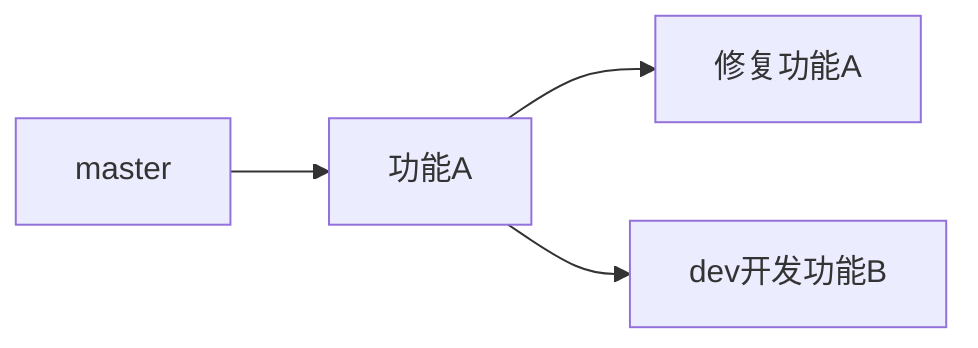

<h1>Git使用 从入门到入土 收藏吃灰系列</h1>

# 一、前言

* 参考安装[Git 详细安装教程](https://blog.csdn.net/mukes/article/details/115693833?ops_request_misc=%7B%22request%5Fid%22%3A%22164239270916780264034862%22%2C%22scm%22%3A%2220140713.130102334..%22%7D&request_id=164239270916780264034862&biz_id=0&utm_medium=distribute.pc_search_result.none-task-blog-2~all~top_positive~default-1-115693833.pc_search_insert_es_download&utm_term=git安装&spm=1018.2226.3001.4187)
* 参考视频[B站 Git最新教程通俗易懂](https://www.bilibili.com/video/BV1FE411P7B3?spm_id_from=333.1007.top_right_bar_window_default_collection.content.click)，这个有点长，感觉讲的精华不多
* 参考视频[『Git』知道这些就够了_哔哩哔哩_bilibili](https://www.bilibili.com/video/BV1BE411g7SV?spm_id_from=333.999.0.0)，这个精华多，推荐看这个
* 参考视频[7小时学会Git 基础全套完整教程（从入门到精通）_哔哩哔哩_bilibili](https://www.bilibili.com/video/BV1tf4y1e7yt?spm_id_from=333.999.0.0)，这个虽然长，但是他偏实践，对小白友好，特别有意思
* [附一个Git动画学习网站](https://oschina.gitee.io/learn-git-branching/)
* [Git教程 - 廖雪峰的官方网站 (liaoxuefeng.com)](https://www.liaoxuefeng.com/wiki/896043488029600)

讲讲小张的感受：我没有接触过`Git`，所以看了很多视频，对于入门使用确实只要知道`git clone`,`git add`,`git commit`,`git push`,`git merge `,确实也就足够了。但是我很好奇背后的原理，为什么要用`git add`到暂存区而不是直接`git commit`？很多指令之间为什么要按一定的顺序执行？所以这个系列我以初学的时候，小白的角度从安装到工作原理(有的是我自己的见解，如果感觉不对，欢迎指正)，再到实际应用！另外，推荐看一遍第三个参考视频，然后看一下第二个参考视频，对工作原理的讲解和实际应用确实不错！

# 二、版本控制

## 2.1什么是版本控制？

>Q：什么是==版本控制==？
>
>A：版本控制(Revision control)是一种在开发过程中用于管理我们对文件、目录或工程等内容的修改历史，方便查看更改历史记录，备份以便恢复以前的版本的软件工程技术。
>
>A：版本迭代，新的版本

- 实现跨区域多人协同开发
- 追踪和记载一个或者多个文件的历史记录
- 组织和保护你的源代码和文档
- 统计工作量
- 并行开发、提高开发效率
- 跟踪记录整个软件的开发过程
- 减轻开发人员的负担，节省时间，同时降低人为错误

简单说就是用于管理多人协同开发项目技术

没有进行版本控制或者版本控制本身缺乏正确的流程管理，在软件开发过程中将会引入很多问题，如软件代码的一致性、软件内容的冗余、软件过程的事物性、软件开发过程中的并发性、软件源代码的安全性，以及软件的整合等问题。

无论是工作还是学习，或者是自己做笔记，都经历过这样一个阶段！不停的修改、提交，我们就迫切需要一个版本控制工具！通过版本控制可以回溯历史版本。


多人开发就必须要使用版本控制！

<h3>常见的版本控制工具</h3>

主流的版本控制器：

- **Git**
- **SVN**（Subversion）
- **CVS**（Concurrent Versions System）
- **VSS**（Micorosoft Visual SourceSafe）
- **TFS**（Team Foundation Server）
- **Visual Studio Online**

版本控制产品非常的多（Perforce、Rational ClearCase、RCS（GNU Revision Control System）、Serena Dimention、SVK、BitKeeper、Monotone、Bazaar、Mercurial、SourceGear Vault），现在影响力最大且使用最广泛的是Git与SVN

## 2.2版本控制的分类

<h3>1.本地版本控制</h3>

记录文件每次的更新，可以对每个版本做一个快照，或是记录补丁文件，适合个人用，如RCS。


<h3>2.集中版本控制  SVN</h3>

所有的版本数据都保存在服务器上，协同开发者从服务器上同步更新或上传自己的修改


所有的版本数据都存在服务器上，用户的本地只有自己以前所同步的版本，如果不连网的话，用户就看不到历史版本，也无法切换版本验证问题，或在不同分支工作。而且，==所有数据都保存在单一的服务器上==，有很大的风险这个服务器损坏，这样就会丢失所有的数据，当然可以定期备份。代表产品：SVN、CVS、VSS

<h3>3.分布式版本控制 Git</h3>

每个人都拥有全部的代码！==安全隐患==！程序员携代码跑路！！！

所有版本信息仓库全部同步到本地的每个用户，这样就可以在本地查看所有版本历史，可以离线在本地提交，只需在连网时push到相应的服务器或其他用户那里。由于每个用户那里保存的都是所有的版本数据，**只要有一个用户**的设备没有问题就可以恢复所有的数据，但这增加了本地存储空间的占用。

不会因为服务器损坏或者网络问题，造成不能工作的情况！


## 2.3Git与SVN最主要区别

>==笔试可能会问到==
>
>Q：Git与SVN最主要区别是什么？
>
>A：SVN是集中式版本控制系统，版本库是集中放在中央服务器的，而工作的时候，用的都是自己的电脑，所以首先要从中央服务器得到最新的版本，然后工作，完成工作后，需要把自己做完的活推送到中央服务器。集中式版本控制系统是必须联网才能工作，对网络带宽要求较高。
>Git是分布式版本控制系统，没有中央服务器，每个人的电脑就是一个完整的版本库，工作的时候不需要联网了，因为版本都在自己电脑上。协同的方法是这样的：比如说自己在电脑上改了文件A，其他人也在电脑上改了文件A，这时，你们两之间只需把各自的修改推送给对方，就可以互相看到对方的修改了。Git可以直接看到更新了哪些代码和文件！

<font size=6 color="#2fc1df">Git是目前世界上最先进的分布式版本控制系统</font>

# 三、Git历史

同生活中的许多伟大事物一样，Git诞生于一个极富纷争大举创新的年代。

Linux 内核开源项目有着为数众广的参与者。绝大多数的 Linux 内核维护工作都花在了提交补丁和保存归档的繁琐事务上(1991－2002年间)。到 2002 年，整个项目组开始启用一个专有的分布式版本控制系统 BitKeeper(付费)来管理和维护代码。

Linux社区中存在很多的大佬！破解研究 BitKeeper ！

到了 2005 年，开发 BitKeeper 的商业公司同 Linux 内核开源社区的合作关系结束，他们收回了 Linux 内核社区免费使用 BitKeeper 的权力。这就迫使 Linux 开源社区(特别是 Linux 的缔造者 Linus Torvalds)基于使用 BitKeeper 时的经验教训，开发出自己的版本系统。(2周左右！)也就是后来的 Git！

Git是免费、开源的，最初Git是为辅助 Linux 内核开发的，来替代 BitKeeper！


Linux和Git之父李纳斯·托沃兹（Linus Benedic Torvalds）1969、芬兰

# 四、Git安装及卸载

## 4.1安装

以下除了第三步修改路径，第四步我加了添加快捷方式，其余都为默认设置，无脑安装即可。只是做了一些解释，如果有需要，可以根据自身情况修改。

<h3>4.1.1软件下载</h3>

[git官网](https://git-scm.com)，下载git对应操作系统的版本。所有东西下载慢的话就可以去找镜像！官网下载太慢，我们可以使用[淘宝镜像下载](http://npm.taobao.org/mirrors/git-for-windows)

[git官网给出的指令教程]([Git - Book (git-scm.com)](https://git-scm.com/book/en/v2))


<h3>4.1.2使用许可声明</h3>

双击下载好的安装包，开始安装，点击**Next**


<h3>4.1.3选择安装目录</h3>

修改一下路径，点击**Next**


<h3>4.1.4选择安装组件</h3>

这里我勾选了添加桌面图标(个人习惯)。点击**Next**


<h3>4.1.5选择开始菜单文件夹</h3>

==文本框不能为空==，如果不要添加到开始菜单，勾选即可。


安装后菜单栏如图


<h3>4.1.6选择 Git 默认编辑器</h3>

Git 安装程序里面内置了 10 种编辑器，比如 `Atom`、`Notepad`、`Notepad++`、`Sublime Text`、`Visual Studio Code`、`Vim` 等等，默认的是` Vim` ，选择 `Vim` 后可以直接进行到下一步，但是` Vim `是纯命令行，操作有点难度，需要学习。如果选其他编辑器，则还需要去其官网安装后才能进行下一步。
下图为默认编辑器 `Vim`可直接点击**Next**到第七步。


如果你不想用 `Vim` 当默认编辑器，换一个，比如 `Notepad++` ，那么你者需要点击下面的蓝色字体 " Notepad++ " 去其官网下载安装好才能进行下一步 **next**


安装后还要配置在`我的电脑->属性->高级系统设置->高级->环境变量->系统变量->Path->编辑添加`Notepad++ 的安装地址，如 `C:\Program Files\notepad++`
这样才能在 Git Bash 里面直接调用 Notepad++。点击**Next**到第七步。

<h3>4.1.7决定初始化新项目(仓库)的主干名字</h3>

第一种是让 Git 自己选择，名字是`master`，但是未来也有可能会改为其他名字；第二种是我们自行决定，默认是`main`，当然，你也可以改为其他的名字。一般默认第一种，点击**Next**到第八步。

**注： 第二个选项下面有个`NEW！`，说很多团队已经重命名他们的默认主干名为`main`. 这是因为2020 年非裔男子乔治·弗洛伊德因白人警察暴力执法惨死而掀起的 Black Lives Matter(黑人的命也是命)运动，很多人认为`master`不尊重黑人，呼吁改为`main`.**


<h3>4.1.8调整path 环境变量</h3>

点击**Next**

**这步意思是指使用什么方式打开git？**

第一种是仅从==Git Bash==使用Git。这个的意思就是你只能通过Git安装后的Git Bash来使用Git，其他的什么命令提示符啊等第三方软件都不行。

第二种是==从命令行以及第三方软件进行 Git==。这个就是在第一种基础上进行第三方支持，你将能够从==Git Bash==，==命令提示符(cmd)== 和  ==Windows PowerShell==以及可以从 ==Windows 系统环境变量==中寻找 Git 的任何第三方软件中使用 Git。推荐使用这个。

第三种是从==命令提示符使用 Git 和可选的 Unix 工具==。选择这种将覆盖 Windows 工具，如 “ find 和 sort ”。只有在了解其含义后才使用此选项。一句话，适合比较懂的人折腾。


>**翻译**
>
>Adjusting your PATH environment
>调整路径环境
>
>How would you like to use Git from the command line?
>您希望如何使用命令行中的Git？
>
>- [ ] use Git from Git Bash only
> 只使用Git Bash中的Git
> 
>  This is the most cautious choice as your PATH will not be modified at all.You wonly be able to use the Git command line tools from Git Bash.
>  这是最谨慎的选择，因为您的路径根本不会被修改，您将只能使用Git命令行工具Git Bash。
> 
>- [ ] Git from the command line and also from 3rd-party software
> git来自命令行，也来自第三方软件。
> 
>  (Recommended) This option adds only some minimal Git wrappers to yourPATH to avoid cluttering your environment with optional Unix tools.
>  (推荐)此选项只向您的PATH添加一些最小的Git包装器，以避免将您的环境与可选的Unix工具相混淆。
> 
>  You will be able to use Git from Git Bash, the Command Prompt and the WindovPowershell as well as any third-party software looking for Git in PATH.
>  您将能够使用Git从Git Bash，命令提示符和WindovPowershell以及任何第三方软件寻找Git的路径。
> 
>- [ ] use Git and optional Unix tools from the Command Prompt
> 从命令提示符中使用Git和可选Unix工具
> 
>  Both Git and the optional Unix tools will be added to your PATH.
>  Git和可选的Unix工具都将添加到您的路径中。
> 
>  Warning: This will override Windows tools like "find" and "sort". onlyuse this option if you understand the implications.
>  警告：这将覆盖Windows工具，如“查找”和“排序”。只有当你理解其含义时，才使用这个选项。
>

<h3>4.1.9选择SSH可执行文件</h3>

点击**Next**


> **翻译**
>
> choosing the SSH executable
> 选择SSH可执行文件
>
> Which Secure Shell client program would you like Git to use?
> 您希望Git使用哪个安全的Shell客户端程序？
>
> - [ ] use bundled opensSH
>   使用捆绑开放SH
>
>   This uses ssh.exe that comes with Git.
>   它使用Git附带的ssh.exe。
>
> - [ ] Use external opensSH
>   使用外部操作系统SH
>
>   NEW!This uses an external ssh.exe.Git will not install its own OpenSSH(and related) binaries but use them as found on the PATH.
>   新的！这将使用外部的ssh.exe.Git不会安装它自己的OpenSSH(和相关的)二进制文件，而是像在路径上找到的那样使用它们。

<h3>4.1.10选择HTTPS后端传输</h3>

点击**Next**


> **翻译**
>
> Choosing HnIPS transport backend
> 选择HnIPS传输后端
>
> which SSL/TLS library would you like Git to use for HTTPS connections?
> 对于HTTPS连接，您希望Git使用哪个SSL/TLS库？
>
> - [ ] use the openSSL library
>   使用OpenSSL库
>
>   server certificates will be validated using the ca-bundle.crt file.
>   服务器证书将使用ca-bundle.crt文件进行验证。
>
> - [ ] use the native Windows secure Channel library
>   使用本机Windows安全通道库
>
>   Server certificates will be validated using Windows Certificate Stores.
>   服务器证书将使用Windows证书存储进行验证。
>
>   This option also allows you to use your company's internal Root CA certificatesdistributed e.g. via Active Directory Domain Services.
>   此选项还允许您使用公司的内部根CA证书，例如通过ActiveDirectory域服务分发的。

这两种选项有什么区别呢？[来自]([git - What's the difference between OpenSSL and the native windows Secure Channel library - Stack Overflow](https://stackoverflow.com/questions/62456484/whats-the-difference-between-openssl-and-the-native-windows-secure-channel-libr))

> 如果在具有企业管理证书的组织中使用 Git，则将需要使用安全通道。如果你仅使用 Git 来访问公共存储库（例如 [GitHub](https://so.csdn.net/so/search?q=GitHub&spm=1001.2101.3001.7020) ），或者你的组织不管理自己的证书，那么使用 SSL 后端（它们只是同一协议的不同实现）就可以了。
>
> 也就是说，作为普通用户，只是用 Git 来访问 Github、[GitLab](https://so.csdn.net/so/search?q=GitLab&spm=1001.2101.3001.7020) 等网站，选择前者就行了。点击next到第十一步。

<h3>4.1.11配置行尾符号转换</h3>

点击**Next**


>**翻译**
>
>Configuring the line ending conversions
>配置行结束转换
>
>How should Git treat line endings in text files?
>How should Git treat line endings in text files?
>
>- [ ] Checkout windows-style, commit Unix-style line endings
>  签出窗口样式，提交unix样式的行尾。
>
>   Git will convert LF to CRLF when checking out text files. When committingtext files, CRLF will be converted to LF. For cross-platform projects,
>   GIT将在签出文本文件时将LF转换为CRLF。提交文本文件时，CRLF将转换为LF。跨平台项目，
>
>   this is the recommended setting on Windows (" core.autocrif" is set to "true").
>   这是在Windows上建议的设置(“core.autocrif”设置为“true”)。
>
>- [ ] checkout as-is, commit Unix-style line endings
>  以-is签出，提交unix样式的行尾。
>
>   Git will not perform any conversion when checking out text files. when
>   当签出文本文件时，git将不会执行任何转换。什么时候
>
>   committing text files,CRLF will be converted to LF.For cross-platform projects,this is the recommended setting on Unix ("core.autocrlf" is set to "input").
>   提交文本文件时，CRLF将转换为LF.or跨平台项目，这是Unix上的建议设置(“core.autocrlf”设置为“input”)。
>
>- [ ] checkout as-is, commit as-is
> 按-原样结帐，按-原样提交
> 
>  Git will not perform any conversions when checking out or committingtext files.Choosing this option is not recommended for cross-platformprojects ("core.autocrlf" is set to "false").
>  当签出或提交文本文件时，git将不会执行任何转换。对于跨平台项目，不建议选择此选项(“core.autocrlf”设置为“false”)。
>

这三种选择分别是：

* 签出 Windows 样式,提交 Unix 样式的行结尾。

* 按原样签出，提交Unix样式的行结尾。

* 按原样签出，按原样提交。`

那 Windows 样式和 Unix 样式到底有什么区别呢？

引用 《[GitHub 入门与实践](https://book.douban.com/subject/26462816/)》 [第 50 页内容](https://blog.csdn.net/mukes/article/details/115693833?ops_request_misc=%7B%22request%5Fid%22%3A%22164239270916780264034862%22%2C%22scm%22%3A%2220140713.130102334..%22%7D&request_id=164239270916780264034862&biz_id=0&utm_medium=distribute.pc_search_result.none-task-blog-2~all~top_positive~default-1-115693833.pc_search_insert_es_download&utm_term=git安装&spm=1018.2226.3001.4187#fn2)

>GitHub 中公开的代码大部分都是以 Mac 或 Linux 中的 LF（Line Feed）换行。然而，由于 Windows 中是以 CRLF（Carriage Return+ Line Feed）换行的，所以在非对应的编辑器中将不能正常显示。
>
>Git 可以通过设置自动转换这些换行符。使用 Windows 环境的各位，请选择推荐的 “Checkout Windows-style，commit Unix-style line endings” 选项。换行符在签出时会自动转换为 CRLF，在提交时则会自动转换为 LF .

上面说 Mac 、Linux、Unix 的 Line Feed ，翻译过来就是换行符，用 “\n” 表示，换行符 “\n” 的 ASCII 值为10；
Windows 的是 Carriage Return+ Line Feed（回车+换行），用 “\r\n” 表示，回车符 “\r” 的 ASCII 值为13；

这上下两者是不一样的。
我们现在的教程就是介绍怎么安装 Windows 版 Git，肯定选第一项啦。

<h3>4.1.12配置终端模拟器以与 Git Bash 一起使用</h3>

点击**Next**


> **翻译**
>
> Configuring the terminal emulator to use with Git Bash
> 配置用于Git Bash的终端模拟器
>
> which terminal emulator do you want to use with your Git Bash?
> 您想在Git Bash中使用哪个终端模拟器？
>
> - [ ] Use MinITY (the default terminal of MsYs2)
>   使用MinITY(MsYs 2的默认终端)
>
>   Git Bash will use MinTTY as terminal emulator, which sports a resizable windownon-rectangular selections and a Unicode font. Windows console programs(sucas interactive Python) must be launched via 'winpty` to work in MinTTY.
>   Git Bash will use MinTTY as terminal emulator, which sports a resizable windownon-rectangular selections and a Unicode font. Windows console programs(sucas interactive Python) must be launched via 'winpty` to work in MinTTY.
>
>   Git Bash 将使用 MinTTY 作为终端仿真器，该仿真器具有可调整大小的窗口非矩形选择和 Unicode 字体。 Windows 控制台程序（例如交互式 Python）必须通过 "winpty" 启动才能在 MinTTY 中运行。
>
> - [ ] use windows' default console window
>   使用windows的默认控制台窗口
>
>   Git will use the default console window of Windows ("cmd.exe"), which works vwith Win32 console programs such as interactive Python or node.js, but has avery limited default scroll-back, needs to be configured to use a Unicode font inorder to display non-ASCII characters correctly, and prior to Windows 10 itswindow was not freely resizable and it only allowed rectangular text selections.
>
>   Git 将使用 Windows 的默认控制台窗口（"cmd.exe"），该窗口可与 Win32 控制台程序（例如交互式Python 或 
>   node.js）一起使用，但默认回滚非常有限，需要将其配置为使用 Unicode 字体才能正确显示非 ASCII 字符，并且在 
>   Windows 10 之前，其窗口不可随意调整大小，并且仅允许选择矩形文本。

建议选择第一种，MinTTY 3功能比 cmd 多，cmd 只不过 比 MinTTY 更适合处理 Windows 的一些接口问题，这个对 Git 用处不大，除此之外 Windows 的默认控制台窗口（'cmd’）有很多劣势，比如 cmd 具有非常有限的默认历史记录回滚堆栈和糟糕的字体编码等等。
相比之下，MinTTY 具有可调整大小的窗口和其他有用的可配置选项，可以通过右键单击的工具栏来打开它们 git-bash 。点击next到第十三步。

<h3>4.1.13选择默认的 “git pull” 行为</h3>


> **翻译**
>
> Choose the default behavior of git pull
> 选择git拉出的默认行为。
>
> what should `git pull` do by default?
> 默认情况下，“git pull”应该做什么？
>
> - [ ] DefaulIt fasiforward .ormerge)
>
>   默认（快进或合并）
>
>   This is the standard behavior of `git pull` : fast-forward the current branch tothe fetched branch when possible, otherwise create a merge commit.
>   这是 "git pull" 的标准行为：在可能的情况下将 当前分支 快进到 获取的分支，否则创建合并提交。
>
> - [ ] Rebase
>   重基
>
>   Rebase the current branch onto the fetched branch. f there are no localcommits to rebase, this is equivalent to a fast-forward.
>   将当前分支重新定位到获取的分支上。不存在要重基的本地提交，这相当于快速转发.
>
> - [ ] only ever fast-forward
>   只有永远快进
>
>   Fast-forward to the fetched branch. Fail if that is not possible.
>   快进到抓取的树枝上。如果这是不可能的，那就失败。

> Q：“git pull” 是什么意思呢？
> A：git pull 就是获取最新的远程仓库分支到本地，并与本地分支合并

上面给了三个 “git pull” 的行为：
第一个是 merge
第二个是 rebase
第三个是 直接获取

第一种 git pull = git fetch + git merge
第二种 git pull = git fetch + git rebase
第三种 git pull = git fetch ？(这个没试过，纯属猜测)

一般默认选择第一项，git rebase 绝大部分程序员都用不好或者不懂，而且风险很大，但是很多会用的人也很推崇，但是用不好就是灾难。

git pull 只是拉取远程分支并与本地分支合并，而 git fetch 只是拉取远程分支，怎么合并，选择 merge 还是 rebase ，可以再做选择。

更多参考资料：

1. 知乎 - git pull 和 git fetch 的区别？ [https://www.zhihu.com/question/38305012]
2. 知乎 - 在开发过程中使用 git rebase 还是 git merge，优缺点分别是什么？ [https://www.zhihu.com/question/36509119]
3. Stackoverflow - Why does git perform fast-forward merges by default? [https://stackoverflow.com/questions/2850369]
4. Stackoverflow - In git how is fetch different than pull and how is merge different than rebase? [https://stackoverflow.com/questions/14894768/]
5. Stackoverflow - Difference between git pull and git pull --rebase [https://stackoverflow.com/questions/18930527]

<h3>4.1.14选择一个凭证帮助程序</h3>

点击**next**


>**翻译**
>
>Choose a credential helper
>选择凭据助手
>
>which credential helper should be configured?
>应该配置哪个凭据助手？
>
>- [ ] Git Credential Manager
>  Git 凭证管理
>
>  Use the cross-platform Git Credential Manager.
>  使用跨平台Git凭据管理器。
>
>  See more information about the future of Git Credential Manager here.
>  请参阅有关Git凭证经理未来的更多信息。
>
>- [ ] None
>  无
>
>  Do not use a credential helper.
>  不要使用凭据助手。

一共两个选项：
Git 凭证管理
不使用凭证助手

第一个选项是提供登录凭证帮助的，Git 有时需要用户的凭据才能执行操作；例如，可能需要输入用户名和密码才能通过 HTTP 访问远程存储库（GitHub，GItLab 等等）。

Windows 的 Git 凭据管理器（Git Credential Manager）是在 Windows 上运行的基于 .NET Framework 的 Git 凭据帮助器。同样，适用于 Mac 和 Linux 的 Git 凭据管理器（Java GCM）是基于 Java 的 Git 凭据帮助器，仅可在 macOS 和 Linux 上运行。尽管这两个项目都旨在解决相同的问题（使用 Git 提供无缝的多因素 HTTPS 身份验证），但它们基于不同的代码库和语言，因此难以确保特性对等。
Git Credential Manager Core（GCM Core）旨在用统一的代码库替换 GCM Windows 和 Java GCM，这在将来应该更容易维护和增强。
登录图如下(属于第一个选项的)


点击**Next**到十五步。

<h3>4.1.15配置额外的选项</h3>

点击**Next**


> **翻译**
>
> Configuring extra options
> 配置额外选项
>
> which features would you like to enable?
> 您希望启用哪些功能？
>
> - [ ] Enable file Svstem caching
>   启用文件缓存系统
>
>   File system data will be read in bulk and cached in memory for certainoperations ("core.fscache" is set to "true").This provides a significantperformance boost.
>   文件系统数据将大容量读取，并缓存在内存中以进行确定操作(“core.fscache”设置为“true”)，这将大大提高性能。
>
> - [ ] Enable symbolic links
>   启用符号链接
>
>   Enable symbolic links (requires the SeCreateSymbolicLink permission).Please note that existing repositories are unaffected by this setting.
>   启用符号链接(需要SeCreateSymbolicLink权限)。请注意，现有的存储库不受此设置的影响。

有两个选项：
启用文件系统缓存
启用符号链接

==启用文件系统缓存==就是将批量读取文件系统数据并将其缓存在内存中以进行某些操作，可以显著提升性能。这个选项默认开启。
==启用符号链接== ，符号链接是一类特殊的文件， 其包含有一条以绝对路径或者相对路径的形式指向其它文件或者目录的引用，类似于 Windows 的快捷方式，不完全等同 类Unix（如 Linux） 下的 符号链接。因为该功能的支持需要一些条件，所以默认不开启。


更多关于 “符号链接” 参考资料：

1. GitHub - Symbolic-Links [https://github.com/git-for-windows/git/wiki/Symbolic-Links]

2. Stackoverflow - How does Git handle symbolic links? [https://stackoverflow.com/questions/954560/]

3. Stackoverflow - What is the difference between NTFS Junction Points and Symbolic Links? [https://stackoverflow.com/questions/9042542/]
   点击**Next**到第十六步。

<h3>4.1.16配置实验性选项</h3>

点击**Next**


> **翻译**
>
> Configuring experimental options
> 配置实验选项
>
> These features are developed actively. Would you like to try them?
> 这些特征得到了积极的发展。你想试试吗？
>
> - [ ] Enable experimental support for pseudo consoles.
>   启用对伪控制台的实验支持。
>
>   (NEW!)This allows running native console programs like Node or Python in aGit Bash window without using winpty, but it still has known bugs.
>   (新的！)这允许在agitBash窗口中运行本地控制台程序，如Node或Python，而无需使用winpty，但它仍然存在已知的bug。
>
> - [ ] Enable experimental built-in file system monitor
>   启用试验性内置文件系统监视器。
>
>   (NEW!)Automatically run a built-in file system watcher, to speed up commonoperations such as`git status`, ' git add', 'git commit', etc in worktreescontaining many files.
>   (新！)自动运行内置的文件系统监视程序，以加快包含多个文件的工作树中的公共操作，如“git status”、“git add”、“git COMMIT”等。

这是实验性功能，可能会有一些小错误之类的，建议不用开启。

点击**install**进行安装。

安装成功！

开始菜单会多出这三个以及鼠标右击


**Git Bash：**Unix与Linux风格的命令行，使用最多，推荐最多

**Git CMD：**Windows风格的命令行

**Git GUI：**图形界面的Git，可以通过它快速创建新仓库（项目），克隆存在的仓库（项目），打开存在的仓库（仓库），不建议初学者使用，尽量先熟悉常用命令

之后来启动测试一下

在如何一个位置右击选择Git Bash Here。输入`ls`,输出当前文件夹内所有文件名称


## 4.2卸载

<h3>4.2.1清除环境变量</h3>


<h3>4.2.2使用控制面板或自己的软件管家之类卸载</h3>


## 4.3风格样式修改

<h3>4.3.1修改language</h3>

右击选择`opinion`


`Windows→UI language→zh_CN`


在外观中可以修改Git Bash的窗口样式


# 五、Git配置
## 5.1设置用户名与邮箱（用户标识，必要）

当你安装Git后首先要做的事情是设置你的**用户名称**和**e-mail**地址。因为每次Git提交都会使用该信息。如果不配置，不能正常提交，会警告先配置后提交。

```bash
git config --global user.name GC-ZF  #名称
git config --global user.email 1310446718@qq.com   #邮箱
```

这里只需要做一次这个设置，因为传递了--global 选项，Git将总是会使用该信息来处理在系统中所做的一切操作。如果希望在一个特定的项目中使用不同的名称或e-mail地址，可以在该项目中运行`git config --local user.name`,`git config --local user.email`

打个比方，如果要区分Github和Gitee的用户提交信息 （[第十一点会实际应用](# 十一、同时配置Gitee、Github公钥)），可以把常用的一个设置为全局变量。单独为另一个账号的仓库设置用户信息，这样就不用频繁地做这步。git 的配置分为三级别，`System` —> `Global` —>`Local`。`System` 即系统级别，`Global` 为配置的全局，`Local` 为仓库级别，优先级是 `Local` > `Global` > `System`

上面这些有点不好懂，举个例子。设置好以后，在本地仓库完成了一次提交(没有push远程)，使用`git log` 可以查看历史提交记录。这里会显示这条历史的作者和邮箱，`push`到远程以后，其他人也可以看到这些修改记录


## 5.2配置文件

所有的配置文件都保存在本地

1. 查看配置 `git config -l`


2. 查看系统配置`git config --system --list`


3. 查看当前用户（global）配置`git config --global --list`


2、3命令的本质其实就是输出配置文件内容

**Git相关的配置文件：**

> 1. Git\etc\gitconfig  ：Git 安装目录下的 gitconfig   --system 系统级
>
> 2. C:\Users\86158\ .gitconfig  只适用于当前登录用户的配置  --global 全局

# 六、常用的命令

先把命令放在第六大点了，不需要看懂。后面会实践，看不懂回来查看。

<h3>6.1Linux命令</h3>

平时一定要多使用！这些可以直接在Git Bush Here中使用。CMD不可以用。

> 1. cd		                          改变目录
>2. cd . .		                      回退到上一个目录，直接cd进入默认目录
> 3. start	<文件名>	      打开文件
> 4. cat       <文件名>          在命令窗口显示文件内容
>5. vim      <文件名>          在命令窗口编辑文件  按“Esc“  输入“：wq”保存文件 ”:e!"放弃更改
> 6. pwd		  显示当前所在的目录路径
>7. ls(ll)		   都是列出当前目录中的所有文件，只不过ll(两个ll)列出的内容更为详细
> 8. touch		新建一个文件 如 touch index.js 就会在当前目录下新建一个index.js文件
>9. rm		     删除一个文件, rm index.js 就会把index.js文件删除。
> 10. mkdir	    新建一个目录,就是新建一个文件夹
>11. rm -r		  删除一个文件夹, rm -r src 删除src目录 ==rm -rf / 切勿在Linux中尝试！删除电脑中全部文件！==
> 12. mv 		   移动文件, mv index.html src，index.html 是我们要移动的文件, src 是目标文件夹,当然, 这样写,必须保证文件和目标 文                                              件夹在同一目录下
>13. reset		重新初始化终端/清屏。
> 14. clear		 清屏
>15. history 	查看命令历史
> 16. help 		帮助
>17. exit 		退出
> 16. ‘#’			表示注释

<h3>6.2常用的git命令</h3>


结合图片记忆基本的命令！

通常提交一个记录只需要依次执行`git add .`,`git commit`,`git push`。操作都是对当前分支有效，加`origin`就可以指定分支。

```bash
# 添加所有文件到暂存区
git add .      

# 添加指定文件到暂存区
git add <filename>

# 提交暂存区中的内容到本地仓库
git commit -m 		#"消息内容"    -m 代表提交信息

#  将当前分支push到远程(远程存在该分支)
git push

# 将xxx分支推到远程上，因为远程上没有这个新的xxx分支，所以要加-u。第一次将新分支提交到远程上时需要加-u
git push origin xxx
git push -u origin xxx				# 效果相同
git push --set-stream origin xxx 	# 效果相同

# 将远程主机的最新内容拉到本地，不进行合并
git fetch

# 将远程主机指定分支最新内容拉到本地，不进行合并
git fetch <远程主机名 默认是origin> <分支名>

#  将远程主机的最新内容拉到本地，与当前本地分支直接合并(仅是当前分支) 等于fetch+merge
git pull
git pull origin <branchName> # 指定分支
```

其它常用命令

```bash
# 克隆
git clone

#查看所有文件状态
git status

#查看指定文件状态
git status <filename>

# 列出所有本地分支
git branch

# 列出所有远程分支
git branch -r

# 新建一个分支，但依然停留在当前分支
git branch <branch-name>

# 新建一个分支，并切换到该分支
git checkout -b <branch-name>

# 切换到别的分支/记录
git checkout <branch-name>

# 合并指定分支到当前分支
$ git merge <branch-name>

# 合并远程分支到当前分支
$ git merge origin <远程分支>

# 删除分支
$ git branch -d <branch-name>

# 删除远程分支
$ git push origin --delete <branch-name>
$ git branch -dr <remote/branch>

# 变基 按提交顺序合并指定分支到当前分支
git rebase 

# 变基	整合到一条
git rebase -i <哈希值>
git rebase HEAD~数字 	#从当前记录到前x个记录合并

# 将添加到暂存区的文件移出
git reset <filename>

# 恢复已删除的文件
git reset <哈希值>--hard

# 将所有未提交的修改（工作区和暂存区）保存至堆栈中
git stash

# "挑拣"提交
git cherry pick
```

`git log`

```bash
# 查看提交记录
git log

# 查看提交记录 展开显示每次提交的内容差异
git log -p

# 查看远程提交记录与本地差异(必须先git fetch 拉取)
git log -p FETCH_HEAD

# 图形化记录
git log --graph

# 简化的图形记录
git log --graph --pretty=format:"%h %s"
git log --graph --online

# 查看 dev 有，而 master 中没有的
git log dev ^master 

# 查看 dev 中比 master 中多提交了哪些内容
git log master..dev

# 不知道谁提交的多谁提交的少，单纯想知道有什么不一样
git log dev...master

# 查看所有记录，包括已删除的文件
git reflog
```

`git diff`用来比较文件之间的不同

```bash
# 当工作区有改动，暂存区为空，diff的对比是"工作区与最后一次commit提交的仓库的所有文件"；
# 当工作区有改动，暂存区不为空，diff对比的是"工作区与暂存区的所有文件"。
git diff
git diff <filename>	# 指定文件

# 显示暂存区(已add但未commit文件)和最后一次commit(HEAD)之间的所有不相同文件的增删改
git diff --cached
git diff --staged

# 比较暂存区和工作区最后一次提交的差别
git diff HEAD
git diff HEAD <filename>	  # 指定文件
git diff <哈希值> <filename>	# 指定某一次提交

# 查看最近一次提交的版本与往过去时间线前数X个的版本之间的所有同git diff HEAD中定义文件之间的增删改
git diff HEAD~X
git diff HEAD^^^…(后面有X个^符号，X为正整数)

# 比较两个分支上最后 commit 的内容的差别
git diff <branch-Name1> <branch-Name2> 
git diff <origin/branch-Name1> <branch-Name2> #比较远程分支与本地分支
git diff <branch-Name1> <branch-Name2> --stat	# 显示简略内容
```

`git tag`用来建立标签

```bash
# 创建本地tag
git tag <tagName>
git tag -a <tagname> -m "XXX..."  # 指定标签信息

# 推送到远程仓库
git push origin <tagName>

# 本地有多条tag，一次推送全部
git push origin --tags

# 切换标签 切换后，分支置空
git checkout <tagName>

# 查看本地某个 tag 的详细信息
git show <tagName>

# 查看本地所有 tag
git tag
git tag -l

# 查看远程所有 tag
git ls-remote --tags origin

# 本地 tag 的删除
git tag -d <tagName>

# 远程 tag 的删除
git push origin <tagName>
```

# 七、Git基本理论(核心)

## 7.1工作区

Git本地有三个工作区域：**工作目录（Working Directory）、暂存区(Stage/Index)、资源库(Repository或Git Directory)**。如果在加上远程的**git仓库(Remote Directory)**就可以分为四个工作区域。文件在这四个区域之间的转换关系如下：


- **Workspace：**工作区，就是你平时存放项目代码的地方
- **Index / Stage：**暂存区，用于临时存放你的改动，事实上它只是一个文件，保存即将提交到文件列表信息(**.git** 隐藏文件)
- **Repository：**仓库区（或本地仓库），就是安全存放数据的位置，这里面有你提交到所有版本的数据。其中HEAD指向最新放入仓库的版本
- **Remote：**远程仓库，托管代码的服务器，可以简单的认为是你项目组中的一台电脑用于远程数据交换

暂存区、仓库区不需要管理，通过命令操作即可

本地的三个区域确切的说应该是git仓库中HEAD指向的版本：


- **Directory：**使用Git管理的一个目录，也就是一个仓库，包含我们的工作空间和Git的管理空间
- **WorkSpace：**需要通过Git进行版本控制的目录和文件，这些目录和文件组成了工作空间
- **.git：**存放Git管理信息的目录，初始化仓库的时候自动创建
- **Index/Stage：**暂存区，或者叫待提交更新区，在提交进入repo之前，我们可以把所有的更新放在暂存区
- **Local Repo：**本地仓库，一个存放在本地的版本库；HEAD会只是当前的开发分支（branch）
- **Stash：**隐藏，是一个工作状态保存栈，用于保存/恢复WorkSpace中的临时状态

> Q：为什么中间多一个暂存区而不是直接提交到本地仓库？
>
> A：使用git时候大多时候是`git add .`一次性添加所有文件，我们习惯性新做一个功能就提交一次。但是如果做了许多个功能，我们就可以分别添加暂存区，分开提交。这样可以保证提交历史的清晰。否则，想要回滚历史的时候，根本分不清每个版本包含了哪些功能，修复了哪些bug。而暂存区的作用就是为了，可以选择提交，比如你在开发B功能的时候，发现A功能还存在Bug，这时候就需要先修复A中的Bug，然后先提交修复的A中的Bug,然后再提交B功能开发的文件。这样就可以提高提交版本历史记录的清晰，方便回滚。而提交是原子性操作，文件的选择就交于暂存区去做，每一次提交都是一个完整的功能开发，保证commit的干净，降低commit的粒度

## 7.2工作流程

<h3>7.2.1git的工作流程：</h3>

１、在工作目录中添加、修改文件；(eg：新建  小张.java)

２、将需要进行版本管理的文件放入暂存区域；(`git add 小张.java`提交JAVA程序或者`git add .`提交文件目录下所有程序)

３、将暂存区域的文件提交到本地仓库。(`git commit`暂存区文件提交到git仓库)

因此，git管理的文件有三种状态：已修改（modified）,已暂存（staged）,已提交(committed)


# 八、Git项目搭建

**7.2简单了解了工作流程，这里实践一下**

## 8.1创建工作目录与常用指令

工作目录(WorkSpace)一般就是你希望Git帮助你管理的文件夹，可以是你项目的目录，也可以是一个空目录，建议不要有中文。

日常使用只要记住下图6个命令：


## 8.2本地仓库搭建

**创建本地仓库的方法有两种：一种是创建全新的仓库，另一种是克隆远程仓库**

<h3>8.2.1创建全新的仓库</h3>

1.创建全新的仓库，初始化空文件夹。在当前文件夹Git Bash Here。出现隐藏文件夹`.git` 

```bash
git init
```


2.执行后可以看到，仅仅在项目目录多出一个.git目录，关于版本等所有信息在这个目录中

<h3>8.2.2克隆远程仓库</h3>

1.另一种方式是克隆远程目录，由于是将远程服务器上的仓库完全镜像一份至本地！

```bash
# 克隆一个项目和它的整个代码历史(版本信息)
git clone [url]
```

2.去gitee或者github上克隆一个测试！下面这是是我的仓库

```bash
git clone https://gitee.com/gc-zhang/git-first.git 
```

## 8.3 Git 本地仓库操作

7.1-8.2学习了git的工作原理，通过工作原理来建立一个本地仓库(远程仓库[十三、git远程命令实践](# 十三、git远程命令实践 )介绍)


首先在本地新建一个文件夹，右击`Git Brash HERE`。依次输入`git init`,`git status`


```bash
# 添加暂存区 文件由红变绿
git add .
```


注意这里的`commit`只上传暂存区的文件，也就是说如果没有`add .`而是`add xxx文件`，提交之后只有xxx被提交。

commit之后，`1 file changed`表示一个文件变更，这里的`insertions`,`deletions`代表代码的增加减少

```bash
git commit -m "xxx"  # xxx即下图中，Github仓库中显示的内容
```


<h3>扩展解释，不需要完全理解，多实践即可</h3>

**文件的4种操作**

版本控制就是对文件的版本控制，要对文件进行修改、提交等操作，首先要知道文件当前在什么状态，不然可能会提交了现在还不想提交的文件，或者要提交的文件没提交上

- **Untracked:** 未跟踪, 此文件在文件夹中, 但并没有加入到git库, 不参与版本控制. 通过`git add`状态变为Staged.
- **Unmodify:** 文件已经入库, 未修改, 即版本库中的文件快照内容与文件夹中完全一致. 这种类型的文件有两种去处, 如果它被修改, 而变为Modified. 如果使用`git rm`移出版本库, 则成为Untracked文件
- **Modified:** 文件已修改, 仅仅是修改, 并没有进行其他的操作. 这个文件也有两个去处, 通过`git add`可进入暂存staged状态, 使用`git checkout `则丢弃修改过, 返回到unmodify状态, 这个`git checkout`即从库中取出文件, 覆盖当前修改 !
- **Staged:** 暂存状态. 执行git commit则将修改同步到库中, 这时库中的文件和本地文件又变为一致, 文件为Unmodify状态. 执行`git reset HEAD filename`取消暂存, 文件状态为Modified

**忽略文件**

有些时候我们不想把某些文件纳入版本控制中，比如数据库文件，临时文件，设计文件等

在项目主目录下建立".gitignore"文件，此文件有如下规则：

1. 忽略文件中的空行或以井号（#）开始的行将会被忽略。
2. 可以使用Linux通配符。例如：星号（*）代表任意多个字符，问号（？）代表一个字符，方括号（[abc]）代表可选字符范围，大括号（{string1,string2,...}）代表可选的字符串等。
3. 如果名称的最前面有一个感叹号（!），表示例外规则，将不被忽略。
4. 如果名称的最前面是一个路径分隔符（/），表示要忽略的文件在此目录下，而子目录中的文件不忽略。
5. 如果名称的最后面是一个路径分隔符（/），表示要忽略的是此目录下该名称的子目录，而非文件（默认文件或目录都忽略）

```bash
#为注释
*.txt        #忽略所有 .txt结尾的文件,这样的话上传就不会被选中！
!lib.txt     #但lib.txt除外
/temp        #仅忽略项目根目录下的TODO文件,不包括其它目录temp
build/       #忽略build/目录下的所有文件
doc/*.txt    #会忽略 doc/notes.txt 但不包括 doc/server/arch.txt
```

IDEA工程项目开发中规则如下：

```bash
*.class
*.log
*.lock

# Package Files #
*.jar
*.war
*.ear
target/

# idea
.idea/
*.iml

*velocity.log*

### STS ###
.apt_generated
.factorypath
.springBeans

### IntelliJ IDEA ###
*.iml
*.ipr
*.iws
.idea
.classpath
.project
.settings/
bin/

*.log
tmp/

#rebel
*rebel.xml*
```

# 九、Git分支

## 9.1什么是分支？

在Gitee仓库界面有一个分支按钮


分支就好比把`D:\项目A\master`复制到了`D:\项目A\dev`，在“dev"中继续工作

新的分支会继承master分支的提交记录，但是新分支里的提交记录不会被master所记录


eg：新建1.0文本提交一次，新建2.0文本提交一次


新建一个分支`新分支`，在`新分支`新建一个3.0文本提交一次。


查看日志，有三次提交记录


切换到master分支，只有两条记录


## 9.2 分支有什么用？

**1.团队开发**

**==master主分支应该非常稳定，用来发布新版本，一般情况下不允许在上面工作，工作一般情况下在新建的dev分支上工作，工作完后，比如上要发布，或者说dev分支代码稳定后可以合并到主分支master上来。==**

开发不同的功能也可以为每一个 功能/小组 分一个新分支。合作完成后，将每一个分支合并到master


如果同一个文件在合并分支时都被修改了则会引起冲突：解决的办法是我们可以修改冲突文件后重新提交！选择要保留他的代码还是你的代码！[会在13.6 git merge讲解决冲突，这里理解什么是分支？](# 13.6 git merge 合并分支的变更)

**2.个人开发**

利用分支，可以将稳定的版本保留在`master`分支中，开发时新建一个分支`dev`，每一次改动完之后，将新分支`dev`合并到`master`中。

另一种是在开发功能时，`dev`分支出现了bug，可以从`dev`分支再切换一个新的分支`fixbug`，处理完bug将`fixbug`合并到`dev`

eg：1.`master`有一个功能A


2.现在开发新的功能，从`master`切一个`dev`分支，`dev`分支会继承`master`分支，开发完后`dev`分支如图


3.假设`master`中功能A出现`bug`，从`master`分支切一个`fixbug`分支，`fixbug`继承`master`，修复完后，`fixbug`分支如图


4.现在切回`master`，`merge`合并分支`fixbug`(合并后`git branch -d fixbug`删除多余的分支，忘截图了)


5.之后`merge`分支`dev`到`master`分支，`master`分支如图




> Q：为什么最后分支图会分叉？
>
> A：第2、3步骤中，新分支都是继承`master`分支"功能A"这条记录。`dev`分支的记录前进到"dev开发新功能"，而`fixbug`分支只是在"功能A"这条记录的基础上修改，它会覆盖上一条记录。`fixbug`分支合并时没有冲突但合并时`dev`分支时本应该链接"功能A"之后，但是"功能A"之后现在链接"修复功能A"，所以会有分叉。

这种分叉可以暂且叫做**“三方合并”**，将“功能A”，“修复功能A”，“dev开发功能B”，三者合并




日志可以完整到看到这个开发的过程，但是过多使用`merge`，会产生很多很多的分叉，分叉之间又相互联系。四五个人不明显，但当十多个人共用一个仓库，整个开发流程就会很乱，进阶git可以学习一下后面讲的`rebase`，可以将整个开发流程整合为一条线

 eg:merge太多

 

# 十、使用Gitee链接远程仓库(免密登录)

如果不设置公钥，每一次`push`远程都需要账号密码。github是有墙的，比较慢，在国内的话，我们一般使用gitee，公司有时候会搭建自己的gitlab服务器


## 10.1链接仓库

1.注册登录[码云](https://gitee.com/)，完善个人信息


2.设置本机绑定SSH公钥，实现免密码登录！（免密码登录，这一步挺重要的，码云是远程仓库，我们是平时工作在本地仓库！)

```bash
# 进入 C:\Users\86158\.ssh 目录 右击Git Bash Here
# 使用rsa加密生成公钥
ssh-keygen -t rsa 
```

一直按回车确认即可，在该文件夹生成两个文件


3.将公钥信息public key添加到码云账户即可

通过查看`cat ~/.ssh/id_rsa.pub` 文件内容，获取到你的 public key或者直接用记事本打开`id_ed2519.pub`,复制内容添加到公钥
也可以打开`C:\Users\86158\\.ssh\id_rsa.pub`

```bash
cat ~/.ssh/id_rsa.pub
```


这里默认本机用户为ssh key的标识符，可以自己修改。标题任意命名。


4.使用码云创建一个自己的仓库


最后三个对勾根据情况，自己选择

许可证：开源是否可以随意转载，开源但是不能商业使用，不能转载。

## 10.2使用指令上传远程仓库

建好以后利用`git clone [url]`命令或者直接下载到本地(下载的文件可以直接复制到本地任意位置，因为.git中保存了当前仓库的信息，可以默认连接远程仓库,eg：克隆在D:\C++，但是我想做JAVA程序，可以把仓库内所有文件复制到D:\JAVA的项目路径下，之后再进行下面步骤)。==注意配置好公钥，选择SSH，本地上传远程就不用输入账号密码了==


第三、四个指令可以键鼠完成。


可以看到仓库中增了demo.txt


# 十一、利用GitHub连接远程仓库(免密登录)

上面学习了gitee，学习github就简单很多了，这里就虽然是英文，但是页面布局基本一致。先删掉上面`C:\Users\86158\.ssh`内所有配置

1.自己新建一个账号 [GitHUb](github.com)。Github在国内被ban了，要自己学会魔法。

2.新建一个仓库`New repository`


3.生成公钥和私钥：输入以下命令

```bash
# 进入 C:\Users\86158\.ssh 目录 右击Git Bash Here
# 使用rsa加密生成公钥
ssh-keygen -t rsa 
```

输完命令连续按三次回车


4.生成的`id_rsa`以文本打开，复制文本内容。

5.将公钥添加到github中


6.克隆仓库时，自己的仓库用SSH链接。克隆别人的仓库用HTTPS。因为自己用HTTPS可能会请求超时。


# 十二、同时配置Gitee、Github 公钥

这种方法使用同时配置多个gitee账号或者同时配置gitee、github、gitlab

**问题**
本地已配置了gitee公钥，如何配置GitHub支持ssh拉取源码？

**思路**
ssh 方式链接到 Github／Gitee，需要唯一的公钥，如果想同一台电脑绑定两个Github/Gitee 帐号，需要两个条件:
1.能够生成两对 私钥/公钥
2.push 时，可以区分两个账户，推送到相应的仓库

**1.创建 ssh key**

进入 `C:\Users\86158\.ssh` 目录 右击`Git Bash Here`。输入

```bash
ssh-keygen -t rsa -C "密钥名称 随便命名" -f "文件名字"
```

例如(分两次输入)，连按三次回车

```bash
ssh-keygen -t rsa -C "GC_Zhang" -f "id_rsa_gitee"
ssh-keygen -t rsa -C "GC-ZF" -f "id_rsa_github"
```


完成后，会在 `C:\Users\86158\.ssh` 文件夹下生成github和码云的私钥和公钥文件


**2.把公钥文件中的 key 复制到 github 和gitee的ssh公钥中**
打开 `id_rsa_gitee.pub`，把相关 ssh key复制到 [gitee](https://gitee.com/) 的 `设置>ssh公钥` 中,标题和公钥不用保持一致


打开 `id_rsa_github.pub`,把相关 ssh key复制到 [github](http://github.com/) 的 `Settings>SSH and GPG keys` 中


**3.创建config 文件解决ssh 冲突**

在 .ssh 的命令窗口下执行 `vi config` 在 config 文件中添加以下代码,完成后按`Esc`输入` :wq` 保存退出
也可以直接在文件夹中新建文本，命名config并删掉后缀`.txt`。

```bash
# 格式
# xxx(#号是注释，给这段加一个备注，不想加也可以)
	Host 任意主机别名
    HostName 域名地址
    IdentityFile ~/.ssh/自己的ssh key的文件路径
    PreferredAuthentications publickey
    User 注册gitee/github/gitlab的用户名
# 参数说明
# Host : 每个Host要取一个别名
# HostName : 要访问的域名地址
# IdentityFile : 指明上面User对应的identityFile路径
```

eg：这里`Host`可以命名其它汉字、名字，我只是为了第4步方便

```bash
# Gitee 
    Host gitee.com
    HostName gitee.com
    IdentityFile ~/.ssh/id_rsa_gitee
    PreferredAuthentications publickey
    User GC-Zhang

# Github      
    Host github.com
    HostName github.com
    IdentityFile ~/.ssh/id_rsa_github
    PreferredAuthentications publickey
    User GC-ZF
```

**4.测试SSH key是否生效**

```bash
ssh -T git@自己配置的Host别名
```


出现`Hi GC_Zhang! You've successfully authenticated, but GITEE.COM does not provide shell access.`就代表配置成功

**5.设置单个仓库的配置**

如果要区分Github和Gitee的用户提交信息 ，可以把常用的一个设置为全局变量。单独为另一个账号的仓库设置用户信息，这样就不用频繁地做这步。git 的配置分为三级别，`System` —> `Global` —>`Local`。`System` 即系统级别，`Global` 为配置的全局，`Local` 为仓库级别，优先级是 `Local` > `Global` > `System`

eg：常用Github，偶尔用Gitee，那么Github的用户信息不用做修改。

克隆Gitee的仓库（每一次克隆新仓库都要重新设置），进入项目文件夹单独设置。查看一下现在的全局配置是什么？

```bash
git config --global --list
```


单独为仓库配置一个用户名(后来我发现不加local后缀也是默认本地)

```bash
# 单独设置仓库 用户名/邮箱 如果没有空格可以不用引号
git config --local user.email "xxx"
git config --local user.name "xxx@x.com"
```


查看本地仓库配置

```bash
git config --local --list
```


提交一次记录，现在日志里的信息就是新设置的用户信息，但仅对当前仓库有效


**多台电脑使用统一的 ssh 文件**

.ssh 文件夹压缩保存，在其他电脑上解压放入对应的目录下
这里需要注意id_rsa 和id_rsa.pub的权限，id_rsa的权限是600，id_rsa.pub的权限是644。

如果上述方法不能通过测试，则需要在目标设备先创建好同名的 ssh ，然后用之前的 私钥和公钥覆盖掉目标设备上的文件

<h4>参考</h4>

这部分参考了这两个，但是稍微做了改进，因为他们是删除全局配置，之后重新配置。我认为不需要对原来的配置删除，将常用的作为全局配置，需要使用另一个不常用的账号的时候再单独配置一个本地配置

[从永远到永远-Windows10配置多个git账号（以两个gitee账号为例）_MACHENIC的博客-CSDN博客](https://blog.csdn.net/MACHENIC/article/details/116212321?ops_request_misc=%7B%22request%5Fid%22%3A%22164273642816780255227080%22%2C%22scm%22%3A%2220140713.130102334.pc%5Fall.%22%7D&request_id=164273642816780255227080&biz_id=0&utm_medium=distribute.pc_search_result.none-task-blog-2~all~first_rank_ecpm_v1~rank_v31_ecpm-4-116212321.pc_search_insert_es_download&utm_term=同时配置gittee&spm=1018.2226.3001.4187)

[亲测本地电脑同时配置gitee和github账号,实现ssh免密拉取和提交代码_初学者乐园的博客-CSDN博客](https://blog.csdn.net/qq3399013670/article/details/103489867?ops_request_misc=%7B%22request%5Fid%22%3A%22164273642816780255227080%22%2C%22scm%22%3A%2220140713.130102334.pc%5Fall.%22%7D&request_id=164273642816780255227080&biz_id=0&utm_medium=distribute.pc_search_result.none-task-blog-2~all~first_rank_ecpm_v1~rank_v31_ecpm-2-103489867.pc_search_insert_es_download&utm_term=同时配置gittee&spm=1018.2226.3001.4187)

第四步可能会遇到一些报错，可以参考这篇文章。因为我的电脑没报错但朋友的有报错，所以没演示

[git@github.com: Permission denied (publickey)_勿忘初心的博客-CSDN博客_git@github.com](https://blog.csdn.net/qq_32786873/article/details/80947195?ops_request_misc=%7B%22request%5Fid%22%3A%22164274798116780357219552%22%2C%22scm%22%3A%2220140713.130102334..%22%7D&request_id=164274798116780357219552&biz_id=0&utm_medium=distribute.pc_search_result.none-task-blog-2~all~sobaiduend~default-2-80947195.pc_search_insert_es_download&utm_term=git%40github.com%3A+Permission+denied+(publickey).&spm=1018.2226.3001.4187)

# 十三、Git远程命令实践

实际操作过程中，可以用编译器的集成插件去实现，但插件按钮也是以**指令**命名的，所以先学会指令，插件很容易上手。这里只介绍git指令如何去操作

## 13.1git reset 移除暂存区

当我们将文件加入暂存区以后，想要修改一下再提交，可以使用`git reset`


## 13.2 git push上传新的分支

正常情况下直接`git push`就可以提交到远程仓库。但是在本地新建了一个分支`4.0`,在`git push`的时候报错，如下


这个错误就是 表示本地分支与远程分支之间没有连接起来，所以在`git push`的时候报错

**解决方法 1**
只需要在输入 `git push -u origin dev`(远程分支名)。这样就可以成功push

**解决方法 2**

按照`git` 的提示，执行以下命令：

```bash
 git push --set-upstream origin dev
```

将远程 `dev` 分支和本地 `dev` 分支相关联。之后再执行 `git push` 即可。一般新建的分支在`push`的时候都需要执行这个命令和远端相关联

另一种情况在[13.8 git pull 拉取到本地](# 13.8 git pull 拉取到本地)。

## 13.3 下载云端分支

默认下载`master`主分支


通过`git checkout`，可以将其它分支克隆到本地


也可以通过这段，将所有分支一次性下载到本地，没有网络连接时仍可以使用``checkout`查看其它分支(仓库文件夹只显示一个分支的文件，实际上已经将全部分支下载到本地`仓库名字\.git\logs\refs\heads`)

```bash
git branch -a | grep origin | grep -v HEAD | while read rb;do lb=$(echo ${rb} | cut -d/ -f 3-);git checkout -b $lb $rb;done
```


## 13.4 git log+git reflog+git reset 版本回退

首先提交了两次文件。第一次新建1.0.txt，`git commit -m "A"`，第二次把1.0删除，提交2.0.txt，`git commit -m "B"`,作为例子


回退完成后，当前最新的记录"2.0.txt"就消失了，如果想再回到2.0,利用`relog`查看历史提交记录


这里可以理解为HEAD记录了一系列指针，链在一起。`git reset`操作就是在移动指针的位置。回退之后，最新的指针就会被删除，需要用`git reflog`去找所有的记录。

## 13.5 git merge 合并分支的变更

这里合并的分支的变更而不是分支的内容。

```bash
git merge <branchName>
```

eg：主管开发了一个项目,功能有A。员工小张、小王分别新建一个分支。小张开发了新功能B，小王开发了新功能C。之后主管将两条分支合并到master分支中。


合并


上代码模拟

每一次`add .`，本地仓库都要做变化，随便加、改一个文件内容就行。这里我修改A.txt的内容

1. 在主分支创建A.txt，内容为"主管"。之后提交到本地仓库

```
主管
```

2. 创建分支`git branch zhang`,`git branch wang`


2. `git checkout zhang`切换分支zhang。修改A.txt的内容，并提交本地仓库

```
主管

小张
```


3. `git checkout wang`切换分支wang。修改A.txt的内容，并提交本地仓库

```
主管

小王提交
```


4. `git checkout master`切换分支master。合并zhang分支到master


现在我们的文本变成了这样


5. 合并wang分支到master


如图，这里显示**“自动合并失败；修复冲突，然后提交结果”**。因为现在的A.txt是master和zhang两个分支合并的结果

打开A.txt


手动修改为，然后添加到本地仓库即可

```
主管

小张

小王提交
```


查看日志，这里记录了所有的提交记录


## 13.6 git fetch 远程仓库

新建两个文件夹，分别`clone`我的一个仓库。模拟两台机器


当前分支仅存在于本地。而远端没有这个分支


总结：如果本地分支是新建的，也就是说没有设置上流分支，则需要使用`git push --set-upstream origin <name>`，先设置上流分支。之后的所有提交直接使用`git push`即可

现在小王想要使用`小张`这个分支。使用`git fetch`查看新分支，仅是查看信息，并没有下载本地


当前本地的分支信息


通过`checkout`切换到新分支，现在本地仓库的文件就切换成了新分支。==注意==必须先`git fetch`，否则`checkout`无效


> 这里新分支并不需要重新设置上流分支，直接`push`即可。因为从远程仓库切的分支，git知道它的来源
>
> Q：为什么需要fetch机制
>
> A：每次checkout的时候，他直接去远程仓库检测是否有该分支。理论上可以，但是实际工作中，使用git是在本地切来切去。只有在团队协作时才需要和远程仓库交互。所以每次checkout都检测远程仓库，浪费网络资源

## 13.7 git pull 拉取到本地

如果此时小张修改了分支内的内容，再次push到了远程仓库。小王如何将新的变更更新到本地？可以`fetch+merge`，也可以`pull`。下载代码并快速合并，如果有冲突，手动合并并提交

```bash
# 拉取并合并当前分支	注意：只是当前分支！
git pull 
```

```bash
# 先拉取指定分支，后合并
git fetch origin master # 从远程主机的master分支拉取最新内容 
git merge FETCH_HEAD    # 将拉取下来的最新内容合并到当前所在的分支中
```

```bash
# 先拉取，后合并
git fetch				# 从远程主机拉取所有分支的最新内容 
git merge <分支名> 	  # 将拉取下来的最新内容合并到当前所在的分支中
```

另一种情况是如果小张push到远程仓库后，小王把小张的程序修改了，也push远程仓库就会报错。正常情况下先`git pull`到本地查看文件改动，如果有冲突，手动改动后再提交


建议使用`fetch+merge`[详解git pull和git fetch的区别：_马恩光的博客-CSDN博客_git pull和fetch的区别](https://blog.csdn.net/weixin_41975655/article/details/82887273?ops_request_misc=%7B%22request%5Fid%22%3A%22164267091316780265412130%22%2C%22scm%22%3A%2220140713.130102334..%22%7D&request_id=164267091316780265412130&biz_id=0&utm_medium=distribute.pc_search_result.none-task-blog-2~all~baidu_landing_v2~default-2-82887273.pc_search_insert_es_download&utm_term=git+fetch和git+pull的区别&spm=1018.2226.3001.4187)

[Git fetch & pull 详解_MuffinFish的博客-CSDN博客_git pull](https://blog.csdn.net/qq_36113598/article/details/78906882?ops_request_misc=%7B%22request%5Fid%22%3A%22164266728216780366544333%22%2C%22scm%22%3A%2220140713.130102334..%22%7D&request_id=164266728216780366544333&biz_id=0&utm_medium=distribute.pc_search_result.none-task-blog-2~all~sobaiduend~default-2-78906882.pc_search_insert_es_download&utm_term=git+fetch&spm=1018.2226.3001.4187)

## 13.8 git rebase 变基

`git rebase`,`git cherry-pick`,`git stash`没前面的重要，初学掌握前七点常用的

假定有一个master分支，在这个分支上有两次commit。之后切出了分支bc，此时bc和master的commit完全一致。之后bc有了第三次、第四次commit，master也有了一次提交。


为了区分commit按时间顺序编号。现在bc以master的前两次commit为基础发展的。如果想要以最新的master版本为base提交commit。也就是说让bc变成1、2、5、3、4一条线，而不是`merge`那样有分叉，这里就需要用`rebase`


`rebase`原理是枚举变更的commit，依次变基。先拿出3号commit，然后以125为基础添加3号commit，再拿出4号commit，以1253为基础添加4号commit。直至所有新增commit完成变基。所以`rebase`就是重新排列base。base就是指commit。

**实战模拟**

先在master完成两次commit。在bc分支完成两次commit。切回master完成一次commit

1.`git log`查看master和bc分支的提交记录


2.在bc分支中执行`git rebase`命令，出现冲突手动解决即可。


3.处理完后add到暂存区，继续下一个commit结点的rebase。

```bash
git rebase --continue
```

重复2、3后如图


<h3>第一种使用情况</h3>

```bash
# 变基	整合多条记录到一条
git rebase -i <哈希值>
git rebase -i HEAD~数字 	#从当前记录到前x个记录合并
```

在开发一个项目时，有四次提交记录，第四次开发完，老板只想看到最初的和最终的日志文件。可以使用`git rebase`简化记录。

1.使用`git log`查看日志


2.合并三条记录

```bash
# 执行任意一个
git rebase -i 80fe8d5cea94a687064a740e6e3f3c91a28032d9
git rebase HEAD~3 	#从当前记录到前x个记录合并
```

下面是提示命令的，自己翻译一下很好懂。这里执行S。然后按`Esc`输入`:wq`


删掉前几次提交的信息输入新的commit。然后按`Esc`输入`:wq`


合并成功，之后可以`git log`一下看一下变化。


==注意：==不要对已经push过远程的记录进行`git rebase -i HEAD`有可能会反而更乱

<h3>第二种使用情况</h3>

接着第一种情况的命令窗口继续操作

1.新切一个`dev`分支，并提交一次记录


2.切回`master`分支，新建一个文本，提交一次记录


3.用`git merge`合并`dev`到`master`。(如果十多个人的团队开发项目，一直使用`merge`，开发记录就会很凌乱)


4.切回`dev`，合并`master `到`dev`


5.在`dev`中提交一次记录


6.切回`master`提交一次记录


7.切回到`dev`分支，`git rebase`


8.因为最终代码要放回`master`主分支，所以切回`master`，执行`git merge`


这样提交记录就是一条线而不是分叉，使提交记录显示的非常简洁。如果有点凌乱可以理解为，在dev分支中`git rebase master`是将master中的记录并过来成==一条线而不是分叉==，之后再回到master，`git merge dev`，这样就不会产生分叉

## 13.9 git cherry-pick 挑选合并

这部分在网上找了这篇，感觉解释相当好，我就不写啦。[FightFightFight的博客](https://blog.csdn.net/FightFightFight/article/details/81039050?ops_request_misc=%7B%22request%5Fid%22%3A%22164266584716781683917658%22%2C%22scm%22%3A%2220140713.130102334..%22%7D&request_id=164266584716781683917658&biz_id=0&utm_medium=distribute.pc_search_result.none-task-blog-2~all~baidu_landing_v2~default-4-81039050.pc_search_insert_es_download&utm_term=git+cherry+pick&spm=1018.2226.3001.4187)

```bash
git cherry-pick <哈希值>
```

## 13.10 git stash 存储到堆栈

这个命令是用来处理bug的，初学可以新建一个分支，在新分支中解决完bug再和主分支合并。但是这一操作可以使用`git stash`来完成

[git stash 命令的用法](https://blog.csdn.net/lamp_yang_3533/article/details/80370380?ops_request_misc=%7B%22request%5Fid%22%3A%22164266982016780264075673%22%2C%22scm%22%3A%2220140713.130102334.pc%5Fall.%22%7D&request_id=164266982016780264075673&biz_id=0&utm_medium=distribute.pc_search_result.none-task-blog-2~all~first_rank_ecpm_v1~rank_v31_ecpm-8-80370380.pc_search_insert_es_download&utm_term=git中stash命令&spm=1018.2226.3001.4187)

[git stash的详细讲解_andyzhaojianhui的专栏-CSDN博客_git stash](https://blog.csdn.net/andyzhaojianhui/article/details/80586695?ops_request_misc=%7B%22request%5Fid%22%3A%22164266646116780271582748%22%2C%22scm%22%3A%2220140713.130102334..%22%7D&request_id=164266646116780271582748&biz_id=0&utm_medium=distribute.pc_search_result.none-task-blog-2~all~sobaiduend~default-5-80586695.pc_search_insert_es_download&utm_term=git+stash&spm=1018.2226.3001.4187)

## 13.11 Git tag 标签


在Github下载别人做好的软件都有这个界面。`tag`是git版本库的一个标记，指向某个[commit](https://so.csdn.net/so/search?q=commit&spm=1001.2101.3001.7020)的指针。主要用于发布版本的管理，一个版本发布之后，我们可以为git打上v 1.0,v 1.1这样的标签。tag需要==单独推送远程==，不能使用`git push`

```bash
git push origin <tagName>
```


> tag感觉跟branch有点相似，但是本质上和分工上是不同的：
>
> tag 对应某次commit, 是一个点，是不可移动的
> branch 对应一系列commit，是很多点连成的一根线，有一个HEAD 指针，是可以依靠 HEAD 指针移动的
> 所以，两者的区别决定了使用方式，改动代码用 branch ,不改动只查看用 tag

`tag` 和 `branch` 的相互配合使用，有时候起到非常方便的效果，例如：已经发布了 v1.0 v2.0 v3.0 三个版本，这个时候，我突然想不改现有代码的前提下，在 v2.0 的基础上加个新功能，作为 v4.0 发布。就可以检出 v2.0 的代码作为一个 branch ，然后作为开发分支


```bash
# 标出标签
git checkout -b <branchName> <tagName>
# 或者先切换标签再新建分支
git checkout <tagName>
git switch -c <branchName>
```

[Git中tag标签的使用_等待化茧成蝶的专栏-CSDN博客](https://blog.csdn.net/wei78008023/article/details/81866590?ops_request_misc=%7B%22request%5Fid%22%3A%22164283763316780271520360%22%2C%22scm%22%3A%2220140713.130102334..%22%7D&request_id=164283763316780271520360&biz_id=0&utm_medium=distribute.pc_search_result.none-task-blog-2~all~sobaiduend~default-1-81866590.pc_search_insert_es_download&utm_term=git+tag&spm=1018.2226.3001.4187)

# 十三、自定义命令

学完上面的指令，有的命令不好记忆，可以自定义命令。

```c++
..\Git\etc\gitconfig		//Git指git安装目录
```

在文件最后添加`[alias]`,格式为`自定义 = 系统默认`

```
[alias]
	lg=log
```

# 十四、GitHub 使用技巧

## 14.1 README.md


新建仓库的时候有一个勾选是否新建"REAME.md"，这个其实就是字面意思。**遇事不决先REAME**，意思是说这个REAME文件会展示在我们的仓库首页，起到简介的作用。".md"是用==markdown==语言编写的文本，我的所有的博客也是通过==markdown==写的，可以看一下我第一次使用CSDN的博客！[入门markdown使用教程(Typora)_鬼才小张同学的博客](https://blog.csdn.net/qq_49488584/article/details/121513406?spm=1001.2014.3001.5501)。

可以在仓库里直接编辑，也可以编辑好以后Push远程。


> 区别下面的Wike，Wike是公司用的。README是站在个人的角度。比方说，现在做了一个开源的软件放在了Github上，别人会先通过README来了解这个软件是做什么用的？

## 14.2 Pin &  Watch & Star

仓库界面


个人主页


**Pin**：代表这个仓库会显示在你的个人主页，类似置定的作用，别人可以率先看到这个仓库

**Watch：**默认是Unwatch。如果某个仓库感兴趣，将其设置为Watch，表示关注这个仓库的动态，当仓库有新的`push`,`Issues`，个人通知中心就会收到消息，如果绑定了邮箱也会发送到邮箱

**Star:**类似一键三连，点赞收藏，表示对项目的支持。Star的项目会收在个人主页。也可以通过标签对仓库分类


所以可以搜一些值得**Watch**的项目，看大佬的开发，如果有任何新动态，可以收到通知，不仅可以查看别人的回答，也可以回答别人提出的问题，这是一个很好的学习成长方式

## 14.3 Issues & Wike

团队开发时，每一个公司不一定在同一个省市，常规的QQ、微信不方便交流，每一个公司有自己的gitlab，以防源码泄露。以github为例子可以使用Issues和Wike

**Issues：**进行文档以及任务管理。有任何的疑问，bug。发起一个Issues。另一方面，如果新成员对项目有问题，可以通过标签筛选查看历史，快速了解项目。或者一个开源项目，其他人发现了bug，也可以通过Issues提交给作者


提交后，代码的管理者就会收到，去解决问题


管理员可以修改问题的状态，收到消息后可以回复消息并关掉问题


**Wiki：**对项目的描述，方便新人了解项目

## 14.4 fork & clone 的区别 & pull request 给开源仓库贡献代码


**fork：**在Github页面，点击fork按钮。将别人的仓库复制一份到自己的仓库

**clone：**将Github中的仓库克隆到自己本地电脑

> Q：`fork`和`clone`都有复制的作用，有什么区别？
>
> A1：`clone`仅是下载了一份代码到本地，不能push远程仓库。
>
> A2：假设有一个开源的仓库A，自己并不是仓库的成员，可以通过`fork`复制到自己的仓库，这样在Github中就有一个一模一样的仓库，但URL不同。对代码进行修改后，可以`git push`到远程仓库，此时作者并看不见你的push，之后通过`pull request`向作者发出请求贡献自己的代码，作者看到请求并决定要不要接受代码，如果作者认为修改是有用的，就会把这个请求并到自己的仓库
>
> A3：比方有一个朋友分享了一个百度网盘链接，但是现在不想下载到本地，所以保存到了自己的云盘。通过`fork`也可以起到这个作用。
>
> Q：如果`fork`了别人的仓库，之后`clone`到本地，仓库更新后，自己的仓库怎么更新？
>
> A：在本地`fetch`拉取一下远程，然后将仓库合并

如果在一个特别有名的开源项目贡献过自己的代码，这部分记录会展现在`log`日志中，面试的时候就可以说自己贡献过什么代码

**14.4**是`pull request`的第二种用法,团队开发，发出请求合并

## 14.5 Organization 团队开发

**1.为仓库添加合作成员**

* 一种是通过新建仓库，在仓库中邀请新成员
* 一种是新建一个组织，在组织中新建仓库(类似新建一个QQ群，使用群文件管理项目)，这样就不用每次都重新邀请一遍团队成员，默认新成员的权限是只读，需要在组织界面`Setting`设置写权限，或者在指定仓库的界面`Setting`。


**2.设置仓库规则**


## 14.6 在线编辑文件 & githubls.com 

我们可以直接在网页对单个文件进行一些简单的操作


但是当一个仓库有很多文件，这个时候需要查阅编辑某个文件，可以直接在仓库界面点击`Go to file`进行查找，也可以克隆到本地，但是有一种更简单的办法，在仓库地址后缀加"ls"变为"githubls.com/xxx/xxx"，也可以在仓库界面直接按`.`，文件就会以文件树的方式展示出来，可以像IDEA那样，直接对文件进行编辑。

也可以自己下载插件，之后在网页运行


也可以去网上找一些插件，比如"Octotree",也可以展示文件树。

## 小结

GitHub中有很多很多的功能，只不过是英文，所以大家回避去探索它，这里只说一了些实用的或者可能用到的一些按钮。自己可以多点点，多探索探索。

# 十五、总结

在[六、常用的命令](#六、常用的命令)没有涉及到的，可以自己尝试输入一下，[十三、Git远程命令实践](#十三、Git远程命令实践)中主要是在实际应用中使用频率很高的命令。初学使用gitee练手，因为github一方面被ban了(自己改下host或者坐飞机，懂得都懂哈哈哈)，一方面全英文


<font size=5 color="Cyan">多敲 多练 多查！指令有很多，多敲可以结合自身情况去记忆其它功能 </font>

前几天发现了一个好玩的log指令，总结的很全

[Git-叹为观止的 log 命令 & 其参数_段浅浅的博客-CSDN博客_git log](https://blog.csdn.net/qq_32452623/article/details/79599503)
